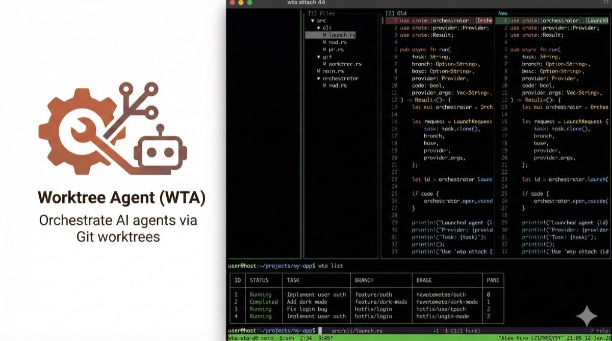

# Worktree Agent (WTA)



A Rust CLI tool for launching Claude Code AI agents in isolated Git worktrees, enabling parallel autonomous task execution with clean branch management.

## Overview

WTA orchestrates Claude Code agents by:
- Creating isolated Git worktrees for each agent
- Managing agents within tmux sessions
- Tracking agent status and task completion
- Providing flexible merge strategies for completed work

## Installation

### Quick Install (Recommended)

```bash
curl -fsSL https://raw.githubusercontent.com/akira/wta/main/install.sh | bash
```

This installs the latest release to `~/.local/bin`. Set `WTA_INSTALL_DIR` to customize the location:

```bash
curl -fsSL https://raw.githubusercontent.com/akira/wta/main/install.sh | WTA_INSTALL_DIR=/usr/local/bin bash
```

### From Source

```bash
cargo install --path .
```

## Usage

### Typical Workflow

```bash
# Basic launch with auto-generated branch name
wta launch --task "Implement user authentication" --branch feature/dark-mode

# List all agents
wta list

# Attach to an agent's tmux window
wta attach <id>

# Diff branch
wta diff <id>

# push a github PR (can use --force if agent not finished)
wta pr <id>
# OR merge
wta merge <id>
```

### Launch an Agent

```bash
# Basic launch with auto-generated branch name
wta launch --task "Implement user authentication"

# With custom branch name
wta launch --task "Add dark mode" --branch feature/dark-mode

# From a specific base branch
wta launch --task "Fix login bug" --base develop

# Use editor for multi-line task descriptions (like git commit)
wta launch --editor              # Uses default editor
wta launch --editor code         # Uses VS Code (--wait added automatically)
wta launch --editor vim          # Uses vim
wta launch -e --branch feature/complex-task
```

Editor resolution: `--editor [cmd]` > `$VISUAL` > `$EDITOR` > `git config core.editor` > `vi`. Lines starting with `#` are comments.

### Monitor Agents

```bash
# List all agents
wta list

# Get status and output for a specific agent
wta status <id>

# Get more lines of output
wta status <id> --lines 100

# Attach to an agent's tmux window
wta attach <id>
```

### Merge Completed Work

```bash
# Merge with default strategy
wta merge <id>

# Rebase strategy
wta merge <id> --strategy rebase

# Squash merge
wta merge <id> --strategy squash

# Force merge even if agent is still running
wta merge <id> --force
```

### Create Pull Requests

```bash
# Create PR with AI-generated title and description
wta pr <id>

# With custom title (AI generates description)
wta pr <id> --title "Add user authentication"

# With custom title and body
wta pr <id> --title "Add auth" --body "Implements OAuth2 flow"

# Force PR creation even if agent is still running
wta pr <id> --force
```

The `pr` command pushes the branch to origin and creates a GitHub PR using the `gh` CLI. When title or body are not specified, it uses Claude to generate a concise title and markdown description from the task.

### View Diffs

```bash
# View diff between agent's branch and base branch
wta diff <id>
```

The `diff` command shows changes between the agent's branch and its base branch. It uses [lumen](https://github.com/jnsahaj/lumen)'s interactive side-by-side viewer if available, otherwise falls back to `git diff`.

### Web Dashboard

```bash
# Start the dashboard server
wta dashboard

# With custom port
wta dashboard --port 8080

# Auto-open browser
wta dashboard --open
```

The dashboard provides a Kanban board UI at `http://localhost:3847` where you can:
- View all agents organized by status (Running, Completed, Failed, Merged)
- Click on any task to view the PR diff
- Merge changes with different strategies (merge, rebase, squash)
- Create GitHub PRs
- Remove agents

The dashboard assets are embedded in the binary, so no additional setup is required.

### Remove Agents

```bash
# Remove an agent, kill window, and cleanup worktree
wta remove <id>

# Force remove even if agent is still running
wta remove <id> --force
```

### Prune Stale Agents

```bash
# Prune stale agents (completed, failed, or merged)
wta prune

# Prune all agents including running ones
wta prune --all

# Prune only agents with a specific status
wta prune --status completed
wta prune --status failed
wta prune --status merged
```

## Agent Lifecycle

```
Launched → Running → Completed/Failed → Merged/Removed
```

1. **Running**: Agent is actively working in its tmux window
2. **Completed**: Agent finished successfully (wrote status file)
3. **Failed**: Agent encountered an error
4. **Merged**: Work merged back to base branch
5. **Removed**: Agent's worktree and branch removed

## Directory Structure

WTA creates the following directories in your repository:

```
.worktrees/           # Git worktrees for each agent
.worktree-agents/
├── state.json        # Agent registry
├── status/           # Agent completion status files
└── prompts/          # Task instructions for agents
```

## Requirements

- Git
- tmux
- One of the supported AI provider CLIs:
  - Claude Code CLI (`claude`) - default
  - Amp Code CLI (`amp`)
  - OpenAI Codex CLI (`codex`)
  - Google Gemini CLI (`gemini`)
  - Deep Agents CLI (`deepagents`)
  - Opencode CLI (`opencode`)
- GitHub CLI (`gh`) - for `wta pr` command
- [lumen](https://github.com/jnsahaj/lumen) (optional) - for interactive diffs in `wta diff`

## Development

### Building from Source

The web dashboard assets must be built before compiling the Rust binary:

```bash
# Install dashboard dependencies and build
cd dashboard
npm install
npm run build
cd ..

# Build the Rust binary
cargo build --release
```

The dashboard assets are embedded into the binary at compile time using `rust-embed`.

### Git Hooks Setup

This project uses git hooks to ensure code quality. To enable them, run:

```bash
git config core.hooksPath .githooks
```

This configures git to use the `.githooks/` directory for hooks. The following hooks are available:

- **pre-commit**: Runs `cargo fmt --all` to format code before committing. If formatting changes are needed, they are applied automatically and the commit is aborted so you can review and stage the changes.

## License

MIT
